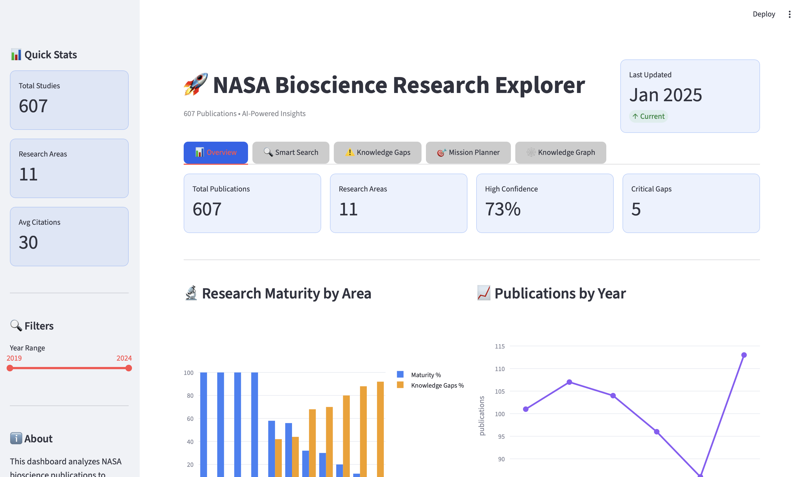
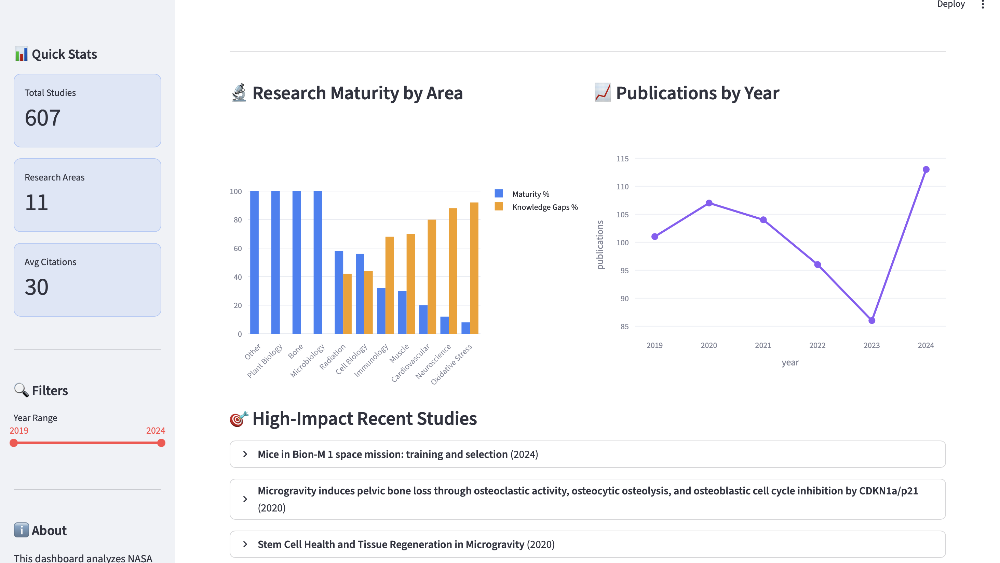
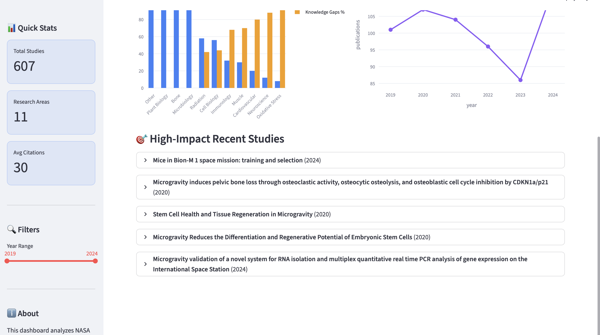
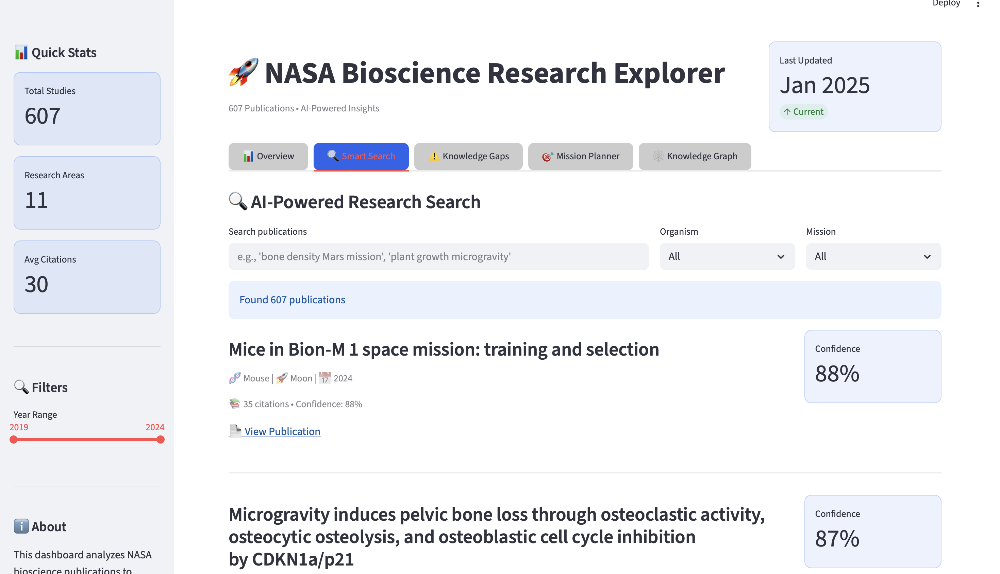
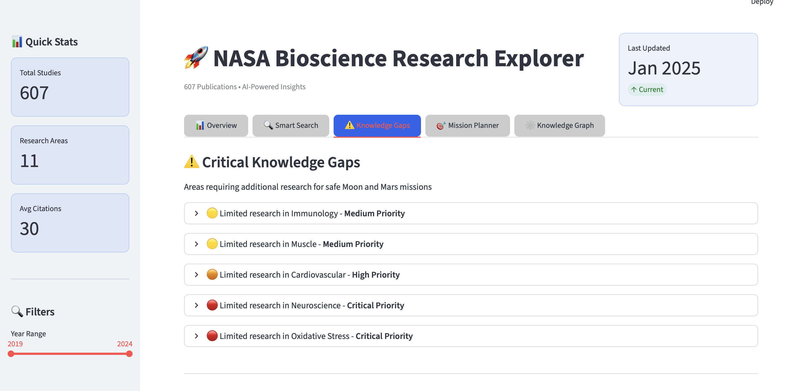
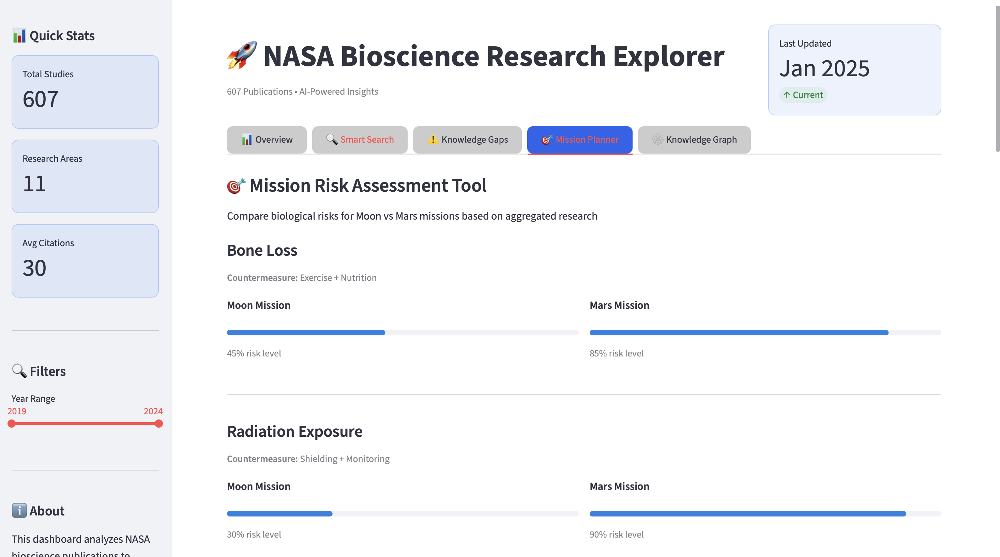
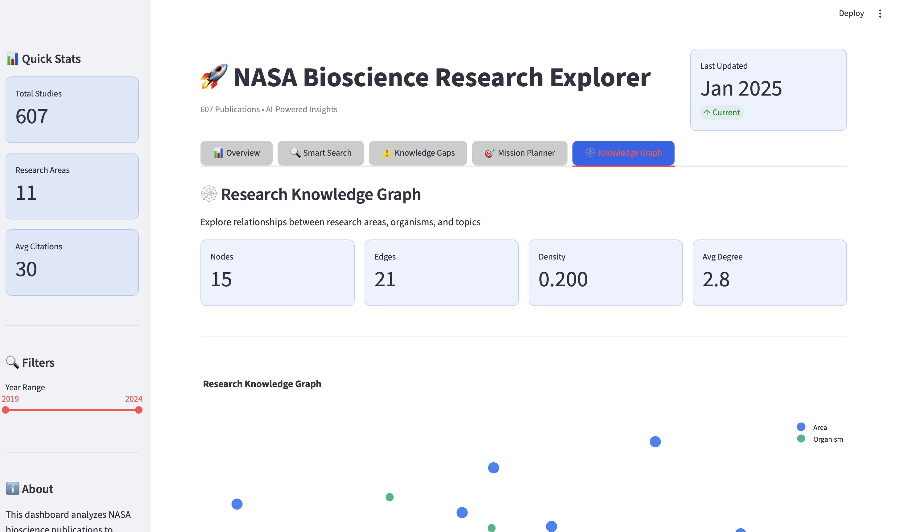

🚀 NASA Bioscience Research Explorer
An AI-powered interactive dashboard for exploring 608+ NASA bioscience publications related to space exploration.

📋 Overview
This dashboard leverages AI, knowledge graphs, and interactive visualizations to help scientists, mission planners, and researchers explore NASA's bioscience research corpus. It provides insights into research progress, identifies knowledge gaps, and enables mission risk assessment for Moon and Mars exploration.
✨ Features

📊 Overview Dashboard: Key metrics, research maturity analysis, and publication trends
🔍 AI-Powered Search: Semantic search using TF-IDF and cosine similarity
⚠️ Knowledge Gap Analysis: Identify critical research gaps for space missions
🎯 Mission Risk Assessment: Compare biological risks for Moon vs Mars missions
🕸️ Knowledge Graphs: Visualize relationships between research areas, organisms, and topics
📈 Interactive Visualizations: Built with Plotly for dynamic exploration

🚀 Quick Start
Prerequisites

Python 3.8 or higher
pip package manager

Installation

Clone the repository

bashgit clone https://github.com/yourusername/nasa-bioscience-dashboard.git
cd nasa-bioscience-dashboard

Install dependencies

bashpip install -r requirements.txt

Add your data

Place your publications.csv file in the data/ folder
Or download from: NASA BPS Publications Repository

Run the application

bashstreamlit run app.py
The dashboard will open automatically in your browser at http://localhost:8501
📁 Project Structure
nasa-bioscience-dashboard/
├── app.py                    # Main Streamlit application
├── requirements.txt          # Python dependencies
├── README.md                 # This file
├── data/
│   └── publications.csv      # NASA publications data
└── utils/
    ├── data_loader.py        # Data loading and preprocessing
    ├── ai_search.py          # AI search and NLP functions
    └── knowledge_graph.py    # Knowledge graph utilities
📊 Data Format
The publications.csv should contain the following columns (adjust as needed):
csvtitle,year,organism,topic,area,missionType,confidence,citations,findings
Required columns:

title: Publication title
year: Publication year
area: Research area (e.g., "Musculoskeletal", "Radiation", "Botany")

Optional columns:

organism: Study organism (Human, Plants, Bacteria, etc.)
topic: Research topic
missionType: Target mission (Moon, Mars, ISS)
confidence: Study confidence score (0-1)
citations: Number of citations
findings: Key findings or abstract
authors: Author list
doi: Digital Object Identifier

🎯 Usage
Basic Navigation

Overview Tab: View summary statistics, research maturity, and high-impact studies
Smart Search Tab: Search publications using natural language queries
Knowledge Gaps Tab: Identify areas requiring more research
Mission Planner Tab: Compare biological risks for different missions

Advanced Features
AI-Powered Search
pythonfrom utils.ai_search import create_search_engine

# Initialize search engine
search = create_search_engine(publications)

# Perform semantic search
results = search.semantic_search("bone density microgravity", top_k=10)
Knowledge Graph
pythonfrom utils.knowledge_graph import KnowledgeGraph

# Create knowledge graph
kg = KnowledgeGraph()
kg.build_from_publications(publications)

# Get central concepts
central = kg.get_central_concepts(top_n=10)

# Visualize
fig = kg.create_interactive_plot()
Data Filtering
pythonfrom utils.data_loader import DataLoader

loader = DataLoader('data/publications.csv')
filtered = loader.filter_publications(
    publications,
    search_query="radiation",
    organism="Human",
    mission="Mars"
)
🛠️ Customization
Adding New Visualizations
Edit app.py to add custom charts:
pythonimport plotly.express as px

# Create custom visualization
fig = px.scatter(publications, x='year', y='citations', 
                 color='area', hover_name='title')
st.plotly_chart(fig, use_container_width=True)
Modifying AI Search
Edit utils/ai_search.py to customize search algorithms:
python# Use different vectorizer
from sklearn.feature_extraction.text import CountVectorizer

self.vectorizer = CountVectorizer(
    max_features=2000,
    ngram_range=(1, 3)
)
Custom Knowledge Graph
Edit utils/knowledge_graph.py to add custom relationships:
python# Add custom edges
if pub['organism'] == 'Human' and pub['area'] == 'Radiation':
    self.graph.add_edge('Human', 'Radiation', 
                       weight=5, type='high_risk')
📚 Data Sources

NASA OSDR - Open Science Data Repository
NASA GeneLab - Omics data from spaceflight
NASA Space Life Sciences Library - Publications
NASA Task Book - Grant information

🔧 Troubleshooting
Common Issues
CSV File Not Found
bash# Ensure your CSV is in the correct location
ls data/publications.csv

# Or update the path in app.py
csv_path = 'your/custom/path/publications.csv'
Import Errors
bash# Reinstall dependencies
pip install --upgrade -r requirements.txt
Memory Issues with Large Datasets
python# In app.py, add pagination
publications_subset = publications.head(100)  # Limit to 100 rows
Port Already in Use
bash# Run on a different port
streamlit run app.py --server.port 8502
🚀 Deployment
Deploy to Streamlit Cloud (Free)

Push your code to GitHub
Go to share.streamlit.io
Connect your GitHub repository
Deploy!

Deploy to Heroku
bash# Create Procfile
echo "web: streamlit run app.py --server.port $PORT" > Procfile

# Deploy
heroku create your-app-name
git push heroku main
Deploy with Docker
dockerfileFROM python:3.9-slim

WORKDIR /app
COPY requirements.txt .
RUN pip install -r requirements.txt

COPY . .

EXPOSE 8501

CMD ["streamlit", "run", "app.py"]
bashdocker build -t nasa-dashboard .
docker run -p 8501:8501 nasa-dashboard
📈 Performance Optimization

Use @st.cache_data decorator for data loading
Limit initial dataset display to 50-100 rows
Use pagination for large result sets
Enable Streamlit's experimental features:

python# In app.py
import streamlit as st

st.set_page_config(
    page_title="NASA Dashboard",
    layout="wide",
    initial_sidebar_state="expanded"
)
🤝 Contributing
Contributions are welcome! Please follow these steps:

Fork the repository
Create a feature branch (git checkout -b feature/AmazingFeature)
Commit your changes (git commit -m 'Add AmazingFeature')
Push to the branch (git push origin feature/AmazingFeature)
Open a Pull Request

📝 License
This project is licensed under the MIT License - see the LICENSE file for details.
🙏 Acknowledgments

NASA Biological and Physical Sciences Division
NASA Open Science Data Repository
Streamlit team for the amazing framework
All NASA researchers whose work made this possible

📧 Contact
Project Link: https://github.com/yourusername/nasa-bioscience-dashboard
🔮 Future Enhancements

 Integration with OpenAI GPT for advanced summarization
 Real-time data updates from NASA APIs
 Export reports to PDF
 Multi-language support
 Advanced network analysis with Neo4j
 Machine learning for research trend prediction
 Collaborative annotation system
 Integration with citation databases